# citeguard

RAG over **BEIR FiQA** (financial QA) with a hand-built, inspectable IR engine and **CiteGuard**,
a verifier that checks every sentence of an LLM answer against the chunk it cites, re-attributes
it to a better chunk when it can, flags it as unsupported when it cannot, and outputs a per-answer
trust score.

IR course hackathon, Track T1 (RAG and trustworthy answers).

```mermaid
flowchart LR
    Q["question"] --> TP["text pipeline<br/>src/text.py"]
    TP --> SP["sparse: tf-idf lnc.ltc / BM25<br/>src/sparse.py + src/index.py"]
    Q --> DE["dense: MiniLM + FAISS<br/>src/dense.py"]
    SP --> RRF["hybrid: weighted RRF<br/>dev-tuned k, w_dense"]
    DE --> RRF
    RRF --> TOP["top-5 numbered chunks"]
    TOP --> LLM["LLM: one citation per sentence<br/>src/generate.py"]
    LLM --> PARSE["sentence + cited chunk pairs"]
    PARSE --> CG{"CiteGuard<br/>src/citeguard.py<br/>support >= threshold?"}
    CG -- yes --> S["SUPPORTED"]
    CG -- no --> BM["BM25 over the other chunks"]
    BM -- best passes --> R["REATTRIBUTED: old to new"]
    BM -- none passes --> U["UNSUPPORTED"]
    S --> NLI{"optional stage 2: NLI<br/>entailed by final chunk?"}
    R --> NLI
    NLI -- yes --> T["trust = SUPPORTED + REATTRIBUTED fraction"]
    NLI -- no --> V["UNVERIFIED"]
    V --> T
    U --> T
```



## Setup

Python 3.11 and [uv](https://docs.astral.sh/uv/).

```bash
make setup                      # venv + requirements.txt
cp .env.example .env            # set LLM_PROVIDER and the matching API key
make build-index                # downloads FiQA, builds sample + full indexes, prints stats
make test                       # unit tests (toy corpus, hand-verified scores)
```

| step | command |
|---|---|
| ask a question | `python -m src.cli ask "Are Roth IRA withdrawals taxed?" --retriever hybrid --full --show-postings --show-scores` |
| verify with NLI instead | add `--nli` |
| two-stage: lexical, then NLI on surviving claims | add `--two-stage` (claims NLI does not confirm become UNVERIFIED) |
| inspect postings / df / idf | `python -m src.cli postings "dividend tax" --full` |
| retriever comparison | `make eval-retrievers` (`FULL=` for the 5k sample; add `--n-queries 648` to `src.eval retrievers` for all test queries) |
| stemming / stop-word ablation | `make eval-ablation` |
| tune zone weights on dev | `make eval-zones` |
| tune weighted RRF on dev | `make eval-rrf` |
| CiteGuard corruption test | `make eval-citeguard` |
| manual labelling | `make labels`, fill `human_label` in `results/manual_labels.csv`, then `make agreement` |
| two-stage evaluation | `make two-stage` |
| web page | `make app` (bare Streamlit) |

**Sample vs full mode.** Every command defaults to a 5,000-document sample for fast iteration
(`--full` for the 57,638-document corpus). The sample keeps every judged document for the eval and
dev queries plus seeded random filler, so sample metrics are optimistic; headline numbers below are full-corpus.

**Reproducibility.** Seeds are fixed (`config.yaml: seed`), query samples are seeded, and every
LLM answer used in the experiments is cached in `results/answers_{dev,test}.json`, so
`make eval` reproduces all tables from a fresh clone without an API key.

## Data

[BEIR](https://github.com/beir-cellar/beir) (Thakur et al., NeurIPS 2021 Datasets & Benchmarks) version of
**FiQA-2018** (Maia et al., WWW'18 companion): 57,638 passages, 648 test queries and 500 dev queries with qrels,
downloaded from the BEIR mirror (`config.yaml: data.url`) and cached in `data/`.

**What is a document.** One FiQA corpus passage (a StackExchange answer) = one document = one RAG chunk.
Passages are short (71 terms on average after processing), so no further chunking is needed.
FiQA has **no titles** (all 57,638 are empty), so the title zone holds each passage's lead sentence
([ADR 0002](docs/adr/0002-lead-sentence-title-zone.md)).

## Which IR principle lives where

| principle | file |
|---|---|
| tokenisation, case folding, stop words, Porter stemming (each toggleable) | `src/text.py` |
| inverted index: dictionary, postings (doc, tf), df, doc lengths, title/body zones | `src/index.py` |
| positional postings and phrase queries; linear-merge postings intersection | `src/index.py` (`phrase`, `intersect`, `boolean_and`) |
| champion lists (top-r by tf) | `src/index.py` (`build_champions`), used in `src/sparse.py` |
| tf-idf VSM, SMART lnc.ltc, cosine, term-at-a-time accumulators, heap top-K | `src/sparse.py` (`TfidfRetriever`) |
| zone weighting `w_title·title + w_body·body` | `src/sparse.py` |
| Okapi BM25 (k1=1.2, b=0.75) | `src/sparse.py` (`BM25Retriever`) |
| dense retrieval, (weighted) Reciprocal Rank Fusion | `src/dense.py` |
| significance: paired randomisation test | `src/metrics.py`, `src/eval.py` (`significance`) |
| P@k, Recall@k, nDCG@k, MRR@k | `src/metrics.py` |
| CiteGuard support = [α·tf-idf cosine + (1−α)·term coverage] · (1 − β·missing-anchor fraction); BM25 re-attribution | `src/citeguard.py` |
| experiments | `src/eval.py` |

Every retriever returns `(doc_id, score)` plus, with `explain=True`, a per-term breakdown whose sum is the score
(shown by `--show-scores`). The core IR is written from scratch: no Lucene, Pyserini, rank_bm25 or sklearn
vectorisers ([ADR 0001](docs/adr/0001-dependencies.md)).

## Results

All numbers: full corpus (57,638 docs), 200 seeded FiQA **test** queries, depth 100.
Anything tuned (zone weight, α, thresholds) was tuned on the **dev** split only.

### 1. Retrievers — `results/retrievers_full.{csv,png}`

| retriever | P@5 | P@10 | Recall@100 | nDCG@10 | MRR@10 | ms/query |
|---|---|---|---|---|---|---|
| tf-idf lnc.ltc (baseline) | 0.072 | 0.051 | 0.513 | 0.173 | 0.194 | 3.9 |
| tf-idf + zones (w_title=0.1) | 0.072 | 0.049 | 0.509 | 0.173 | 0.207 | 4.7 |
| tf-idf + champion lists (r=200) | 0.056 | 0.040 | 0.411 | 0.154 | 0.168 | **0.33** |
| BM25 (k1=1.2, b=0.75) | 0.102 | 0.064 | 0.564 | 0.241 | 0.277 | 5.3 |
| dense (MiniLM-L6 + FAISS) | 0.154 | 0.095 | 0.725 | 0.376 | **0.446** | 12.2 |
| hybrid, plain RRF (k=60, equal weights) | 0.140 | 0.094 | 0.709 | 0.352 | 0.397 | 20.4 |
| hybrid, weighted RRF (k=10, w_dense=0.6, dev-tuned) | **0.163** | **0.102** | **0.729** | **0.386** | 0.439 | 21.0 |

* **Sanity check:** our from-scratch BM25 scores nDCG@10 = 0.241, against the 0.236 reported for BM25 on FiQA in the BEIR paper.
* BM25's length normalisation and saturating tf beat lnc.ltc by +0.07 nDCG@10.
* Champion lists are **11.7× faster** than the full tf-idf scan but lose 0.10 Recall@100: the classic speed/quality trade-off.
* Zones: the dev sweep (`results/zones_dev_full.csv`) picked w_title = 0.1 (+0.016 nDCG@10 on dev). On test it is neutral (MRR +0.013, nDCG ±0), as expected for a "title" that duplicates the body (ADR 0002).
* **Hybrid vs dense.** Plain RRF is *below* dense, because equal weights let the much weaker BM25 run pull the
  dense ranking down. Weighted RRF, `score(d) = (1−w)/(k+rank_bm25) + w/(k+rank_dense)`, was tuned on 100 dev
  queries (`results/rrf_dev_full.csv`: k=10, w_dense=0.6). On the 200-query sample above, its +0.010 nDCG@10 over
  dense is not significant (p = 0.44). On **all 648 test queries** it is, as shown below.

#### All 648 FiQA test queries — `results/retrievers_full_q648.csv`, `results/significance_full_q648.csv`

| retriever | P@5 | P@10 | Recall@100 | nDCG@10 | MRR@10 |
|---|---|---|---|---|---|
| tf-idf | 0.078 | 0.053 | 0.519 | 0.178 | 0.212 |
| tf-idf + zones | 0.078 | 0.055 | 0.522 | 0.182 | 0.220 |
| tf-idf + champion lists | 0.058 | 0.040 | 0.385 | 0.136 | 0.158 |
| BM25 | 0.109 | 0.069 | 0.559 | 0.252 | 0.311 |
| dense | 0.168 | 0.105 | 0.706 | 0.369 | 0.445 |
| hybrid, plain RRF | 0.160 | 0.101 | 0.704 | 0.364 | 0.439 |
| **hybrid, weighted RRF** | **0.174** | **0.109** | **0.713** | **0.387** | **0.462** |

Paired randomisation test, weighted hybrid vs dense (two-sided, 10k sign flips):

| metric | mean difference | wins / ties / losses | p |
|---|---|---|---|
| nDCG@10 | +0.019 | 172 / 334 / 142 | **0.003** |
| P@10 | +0.005 | 64 / 545 / 39 | **0.008** |
| MRR@10 | +0.017 | 121 / 417 / 110 | 0.076 |
| Recall@100 | +0.007 | 50 / 548 / 50 | 0.33 |

Weighted fusion significantly improves early precision over dense (nDCG@10, P@10). Recall@100 is unchanged:
fusion reorders the top of the list but finds few new relevant documents. Plain RRF is not significantly
different from dense (nDCG@10 p = 0.58). The weights were tuned on dev; the test queries were never used for tuning.

### 2. Ablation — `results/ablation_full.{csv,png}`

| | stop words removed + stemming | no stemming | no stop-word removal | neither |
|---|---|---|---|---|
| tf-idf nDCG@10 | **0.173** | 0.148 | 0.174 | 0.163 |
| BM25 nDCG@10 | **0.241** | 0.217 | 0.231 | 0.214 |
| BM25 ms/query | 5.3 | 3.8 | 31.7 | 30.4 |
| vocabulary | 54,837 | 75,409 | 54,927 | 75,557 |

Stemming cuts the vocabulary by 27% and adds ~0.02–0.025 nDCG@10. Removing stop words barely
changes quality, but makes queries **6× faster**, because stop words have the longest postings lists.

### 3. CiteGuard corruption test — `results/citeguard_*.{csv,png}`

Answers were generated (Groq `openai/gpt-oss-120b`, top-5 from plain-RRF hybrid; they are cached, so later retriever changes do not alter this experiment)
for 30 dev and 40 test queries. Then 30% of citations were swapped to a different retrieved chunk at random (seeded), so we know
exactly which citations are wrong. A checker *flags* a sentence when support(sentence, cited chunk) < τ.

The **anchor penalty** multiplies lexical support by (1 − β · m), where m is the fraction of the sentence's
*anchors* that are missing from the cited chunk. Anchors are numbers (digits, or number words that quantify, such as "three-month"),
plus named entities (capitalised non-initial words and acronyms). α, β and τ were tuned together on dev
(`citeguard_alpha_dev.csv`, settings saved in `citeguard_tuned.json`).

| checker (test: 152 sentences, 51 swapped) | α | β | τ | precision | recall | F1 | flagged swaps whose original chunk was recovered |
|---|---|---|---|---|---|---|---|
| lexical | 0.75 | 0 | 0.18 | 0.87 | 0.67 | 0.76 | 74% (25/34) |
| **lexical + anchors** | 0.75 | 0.25 | 0.18 | **0.88** | 0.69 | **0.77** | **74%** (26/35) |
| NLI cross-encoder (deberta-v3-small) | — | — | 0.01 | 0.49 | 0.80 | 0.61 | 41% (17/41) |

Flagging everything gives F1 = 0.50. The NLI model's entailment probabilities are near zero for most real
answer sentences, so its dev-tuned threshold collapses to 0.01. Anchors add one detection (+0.014 F1).

### 4. Manual labels: real answers, no corruption — `results/manual_agreement*.csv`

I labelled 70 sentences from 20 real test answers: 1 if the cited chunk supports the sentence, 0 if not
(`results/manual_labels.csv`). 10 of the 70 are unsupported. The labels are a held-out test: each checker runs
with its dev-tuned settings from the corruption experiment.

| checker | unsupported caught | flagged | precision (unsupported) | accuracy | Cohen's κ |
|---|---|---|---|---|---|
| lexical | 0 / 10 | 2 | 0.00 | 0.83 | −0.05 |
| lexical + anchors | 0 / 10 | 2 | 0.00 | 0.83 | −0.05 |
| NLI | **6 / 10** | 31 | 0.19 | 0.59 | 0.10 |

**What this shows.** The two kinds of checker are good at different jobs:
* **Wrong-chunk citations** (section 3): the lexical IR checker is clearly better (F1 0.77 vs 0.61), and its
  BM25 re-attribution recovers the right chunk 74% of the time.
* **Real unsupported claims** in on-topic sentences: lexical overlap misses all of them. None of the 10
  contain an invented number or entity, so the anchor penalty cannot fire. They are unsupported *inferences*
  ("…can result in the loan application being denied", "…would then be treated as taxable income") that reuse
  the chunk's vocabulary. NLI catches 6/10, but flags 31 of 70 sentences to do it.

This motivated the two-stage verifier in section 5.
Caveats: 70 sentences, 10 positives, one annotator.

### 5. Two-stage verification — `results/two_stage_*.{csv,png,json}`

Stage 1 is the lexical+anchors checker with re-attribution. Stage 2 runs NLI on every sentence that survives
stage 1, against its *final* chunk; a sentence whose entailment is below τ₂ becomes **UNVERIFIED**.
The dev corruption set has no examples of unsupported claims inside the right chunk, so τ₂ is chosen to maximise
F0.5 (weighting precision) under **5-fold stratified cross-validation** on the 70 labels. The fold thresholds
were 0.0063, 0.0040, 0.0063, 0.0063, 0.0063, so the deployed τ₂ = 0.0063.

| verifier (70 labelled sentences, 10 unsupported) | caught | flagged | precision | recall | F0.5 | κ |
|---|---|---|---|---|---|---|
| stage 1 only | 0 | 2 | 0.00 | 0.00 | 0.00 | −0.05 |
| NLI only (dev-tuned τ = 0.01) | 6 | 31 | 0.19 | 0.60 | 0.22 | 0.10 |
| two-stage, τ₂ dev-tuned (0.01), fully held out | 6 | 31 | 0.19 | 0.60 | 0.22 | 0.10 |
| **two-stage, τ₂ by 5-fold CV** (honest estimate) | 5 | 25 | 0.20 | 0.50 | 0.23 | 0.10 |
| two-stage, τ₂ fit on all 70 (in-sample, optimistic) | 6 | 27 | 0.22 | 0.60 | 0.25 | 0.15 |

On the corruption test (`two_stage_corruption.csv`), adding stage 2 raises recall on swapped citations
(0.69 → 0.84) but halves precision (0.88 → 0.52; F1 0.77 → 0.65). It flags 82 of 152 sentences.

**Honest reading.** Two-stage makes CiteGuard able to catch real unsupported claims at all: stage 1 alone
catches none. But the small NLI model is a weak judge here. Its precision (0.20) is barely above the 0.14 base
rate, and its agreement with the human labels is only slight (κ ≈ 0.10). The main suspect is the premise:
FiQA chunks are long and get truncated at 512 tokens, and the model judges the whole chunk at once rather than the
sentence that actually matters. So two-stage is off by default (`--two-stage` turns it on), and UNVERIFIED should read as
"check this", not "false". Example from the CLI: "…once the account has satisfied the five-year rule…" was cited to a
chunk that never mentions it. It was marked UNVERIFIED (NLI 0.004, missing anchor `5`).

## What works / what's planned

Works: everything in the pipeline above, end to end in the CLI and the Streamlit page; all experiments
write CSV + PNG to `results/`; 44 unit tests, including lnc.ltc and BM25 scores on a toy corpus checked against
hand calculation (`tests/test_sparse.py`).

Planned / not done yet:
* Sentence-window NLI premises: take the max entailment over 1–3-sentence windows of the chunk instead of the truncated whole chunk. This is the likely fix for stage 2's low precision.
* A larger NLI model (e.g. deberta-v3-base/large) for stage 2.
* More labelled sentences and a second annotator (inter-annotator κ) before trusting the agreement numbers.
* BM25F over the zones, instead of applying zone weighting to tf-idf only.

## AI use

This code was written with an AI coding agent (Claude Code, Claude Opus 5.5), working from my
specification and in stages: each stage was run, its output checked (e.g. full-corpus BM25 nDCG@10 against
the published BEIR figure), and errors fixed before moving on. Design decisions are recorded in `docs/adr/`.
The LLM used inside the system for answer generation is configurable (default: Groq, `openai/gpt-oss-120b`).
